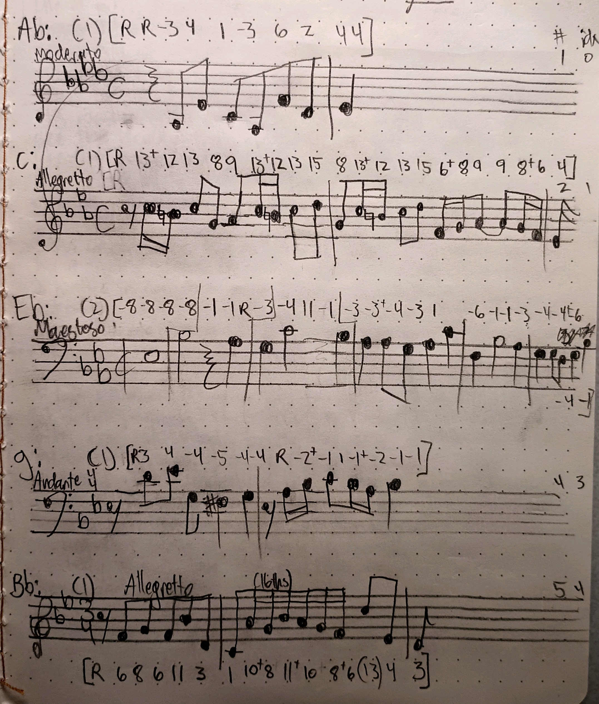

# Artist Statement

We have designed a "Well-Tempered Arduino" that creates music based on the user's input. The project is programmed with five looping melodies that reference fugue subjects from The Well-Tempered Clavier by J.S. Bach. These can be transposed and combined in various ways to create a unique piece of sound art. The main tempo is also configurable.

## Musical Inspiration

A fugue starts by introducing the subject (a simple melody) in one voice. Throughout the piece, this subject is repeated and transformed in various ways across different voices (typically three or four). Bach wrote two books of 24 preludes and fugues (The Well-Tempered Clavier), one in each major and minor key. These pieces are some of the most important in the Western classical music tradition, so they seemed a fitting source of inspiration for our project.

The goal was to produce novel results by layering simple repeating melodies together. As we have discussed in class, one thing is interesting, but many things are many times as interesting. The melodies are simple and repetitive, but when combined, they create a complex and evolving piece of music. Allowing the user to transpose, enable, or disable melodies adds even more dimension to the piece as new combinations are formed.

## Technical Details

10 pushbuttons with pull-down resistors are used to transpose the melodies (each one has a transpose up and transpose down button). A DIP switch is used to enable or disable each melody, and a potentiometer is used to control the tempo. The Arduino polls the buttons, digitally debounces them, and sends the information over serial to a Python program. The Arduino is not really cut out for audio synthesis and layering (it has limited PWM pins and processing power, and lacks a DAC), so the Python program does the heavy lifting. 

The Python program keeps track of states for each melody and processes the serial data. It continuously generates audio output based on the enabled melodies and the tempo. Each melody's note consists of a fundamental frequency and a few harmonics, all sine waves. Allowing the user to modify harmonics and wave shapes could be an interesting extension of this project.

Finally, all generated melody notes are overlayed and played through the computer speakers.

## A note on tuning

Although this project is named "The Well-Tempered Arduino," we are actually playing on equal temperament (the standard tuning system used in Western music today). In equal temperament, the octave is divided into 12 equal parts, and each note is a fixed logarithmic ratio away from the previous note. This system sounds good in any key, but comes with a compromise: some consonant intervals are not perfectly in tune with the natural harmonic series. On a technical note, this also makes the note frequencies much easier to calculate. :)

Well temperament, on the other hand, is a historical tuning system that preserves natural harmonics in a few keys at the expense of others. Bach's "Well-Tempered Clavier" was written to demonstrate the musical possibilities of this tuning system.

Our project uses equal temperament, but we named it "The Well-Tempered Arduino" as a nod to Bach's melodies which we use.
